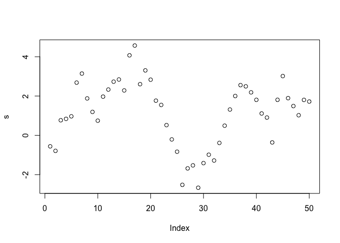

atsar (Applied Time Series Analysis in R)
=========================================

The atsar R package implements Bayesian time series models using Stan, primarily for illustrative purposes and teaching (University of Washington's Fish 507, Applied Time Series Analysis). The Stan webpage, and appropriate citation guidelines are [here](http://mc-stan.org/). You can cite the package as:

Citation: Ward, E.J., M.D. Scheuerell, and E.E. Holmes. 2018. 'atsar': Applied Time Series Analysis in R: an introduction to time series analysis for ecological and fisheries data with Stan. [](https://doi.org/10.5281/zenodo.1158021)

You can install the development version of the package with:

``` r
# install.packages("devtools")
devtools::install_github("nwfsc-timeseries/atsar")
```

An example model
----------------

Simulate data:

``` r
library(rstan)
#> Loading required package: ggplot2
#> Loading required package: StanHeaders
#> rstan (Version 2.16.2, packaged: 2017-07-03 09:24:58 UTC, GitRev: 2e1f913d3ca3)
#> For execution on a local, multicore CPU with excess RAM we recommend calling
#> rstan_options(auto_write = TRUE)
#> options(mc.cores = parallel::detectCores())
library(atsar)
#> Loading required package: Rcpp
#> Warning: package 'Rcpp' was built under R version 3.4.3
set.seed(123)
s = cumsum(rnorm(50))
```

``` r
plot(s)
```



Fit several models to this data:

``` r
# Regression, no slope
regression_model = fit_stan(y = s, x = model.matrix(lm(s~1)), model_name="regression")

# Regression, with slope
regression_model = fit_stan(y = s, x = model.matrix(lm(s~seq(1,length(s)))), model_name="regression")

# AR(1) time series model
ar1_model = fit_stan(y = s, est_drift=FALSE, P = 1, model_name = "ar")

# ARMA(1,1) time series model
arma1_model = fit_stan(y = s, model_name = "arma11")

# univariate ss model -- without drift but mean reversion estimated
ss_model = fit_stan(y = s, model_name = "ss_ar", est_drift=FALSE)
```

References
==========

Additional information can be found on our NWFSC time series page which includes several additional books and packages, [NWFSC time series page](https://nwfsc-timeseries.github.io/).
